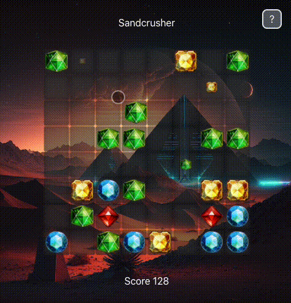

# Sandcrusher



Web game made with `typescript`, using `PixiJS` and `SolidJS`, bootstrapped with `Vite`

- [Vite](https://vitejs.dev)
- [PixiJS](https://pixijs.com)
- [SolidJS](https://solidjs.com)

## Usage

```bash
$ npm install # or pnpm install or yarn install
```

## Available Scripts

In the project directory, you can run: `npm dev` or `npm start`

Runs the app in the development mode.<br>
Open [http://localhost:3000](http://localhost:3000) to view it in the browser.

The page will reload if you make edits.<br>
